## 计算机毕业设计Spark+大模型高考推荐系统 知识图谱高考分数线预测 高考数据分析可视化 高考大数据 大数据毕业设计

## 要求
### 源码有偿！一套(论文 PPT 源码+sql脚本+教程)

### 
### 加好友前帮忙start一下，并备注github有偿大模型高考推荐系统
### 我的QQ号是2827724252或者798059319或者 1679232425或者微信:bysj2023nb 或bysj1688

# 

### 加qq好友说明（被部分 网友整得心力交瘁）：
    1.加好友务必按照格式备注
    2.避免浪费各自的时间！
    3.当“客服”不容易，repo 主是体面人，不爆粗，性格好，文明人。
## 介绍
使用vue+springboot前后端分离的架构实现，数据库采用了mysql
1. 利用协同过滤推荐算法实现高校推荐（UserCF+ItemCF双推荐算法）、CNN预测高考分数线
2. 利用千问大模型API实现高考志愿相关的智能问答
3. 根据自己的分数进行填报志愿模拟，可以给出分数接近的学校的推荐
4. 各地招生政策查看（支持后台编辑）
5. 学校信息查询、热门院校、学校详情
6. 登录注册、修改密码等
Hadoop+Spark数据大屏 + 后台高校、分数线数据增删改查

## 演示视频
https://www.bilibili.com/video/BV1qQCXYcEzh/?spm_id_from=333.999.0.0

## 截图

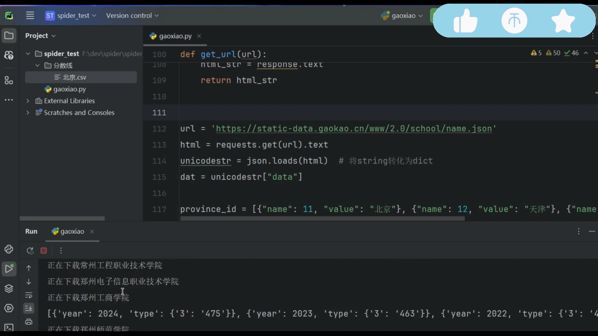
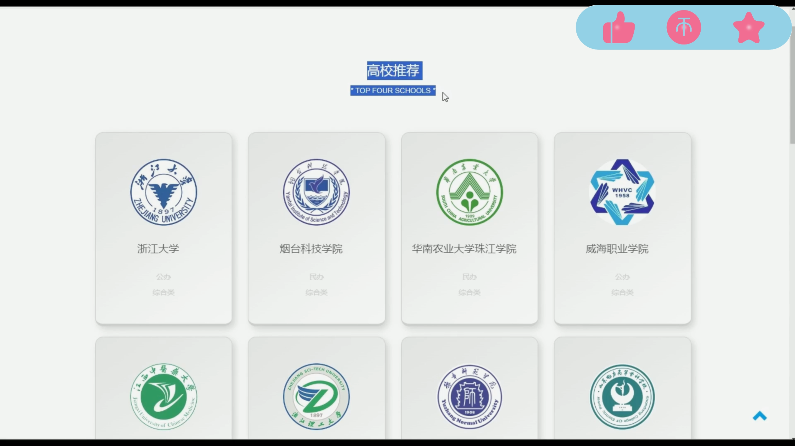
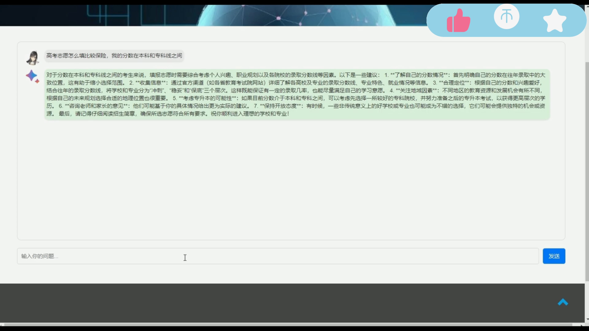
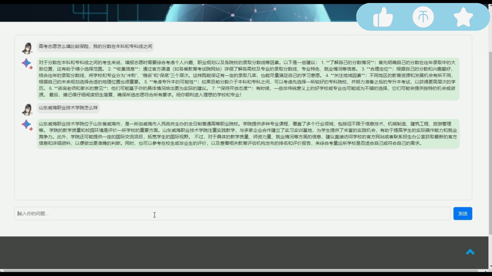
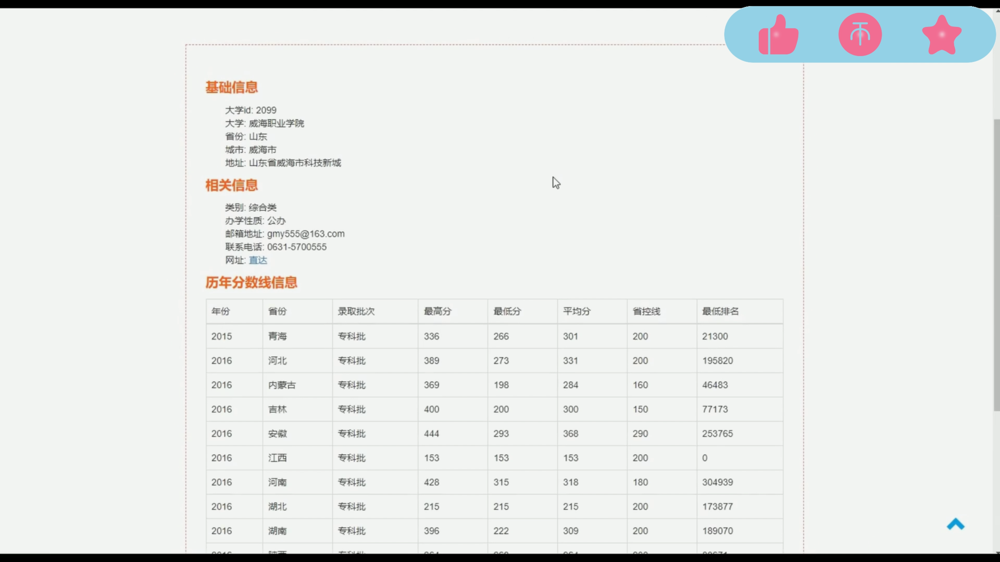
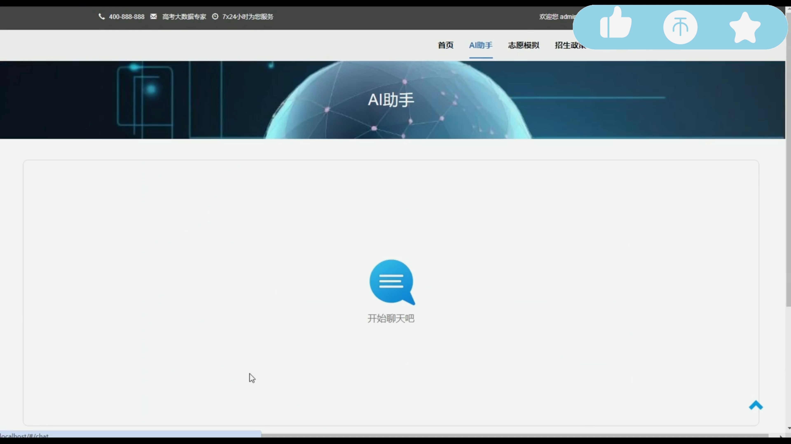
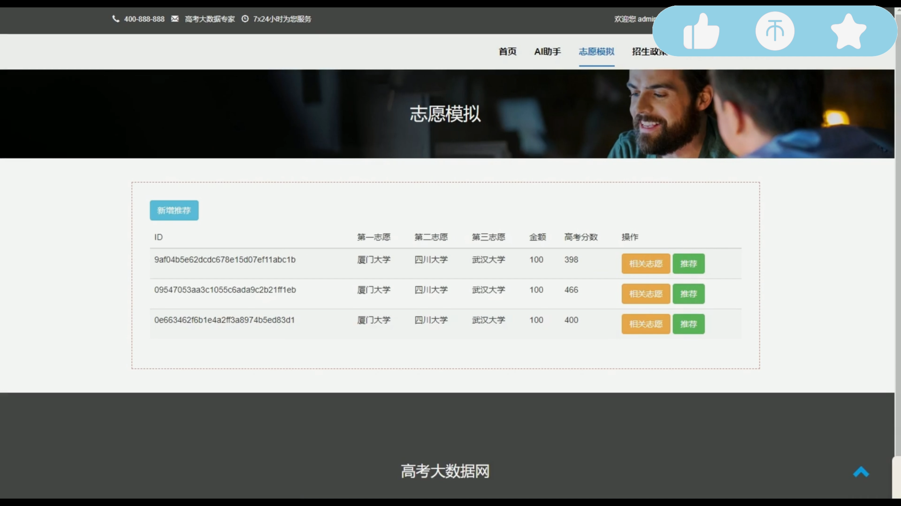
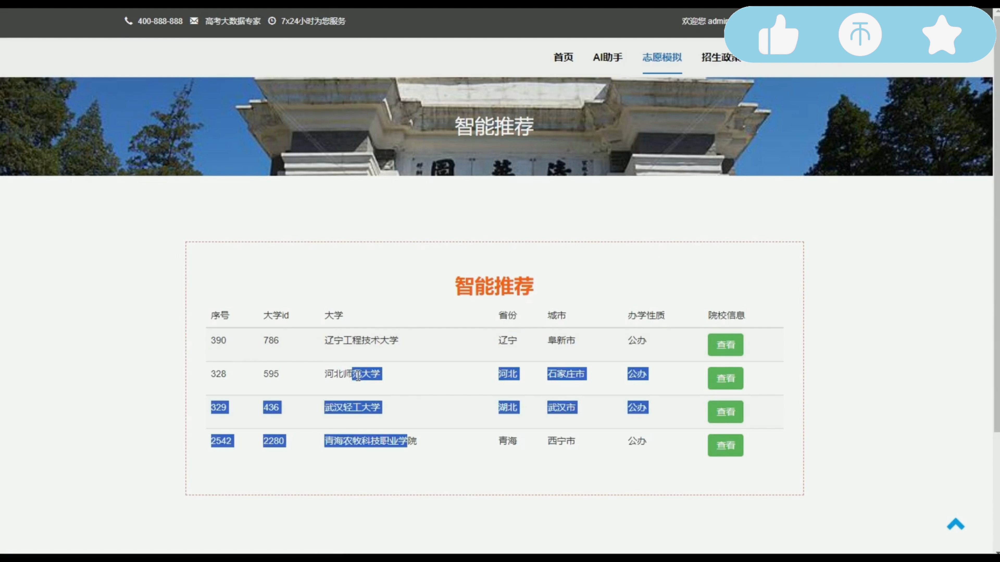
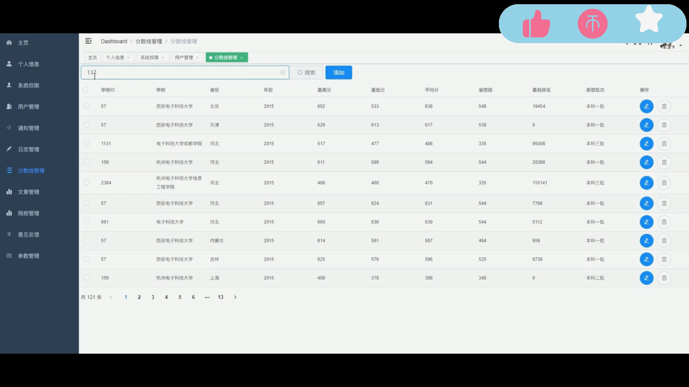
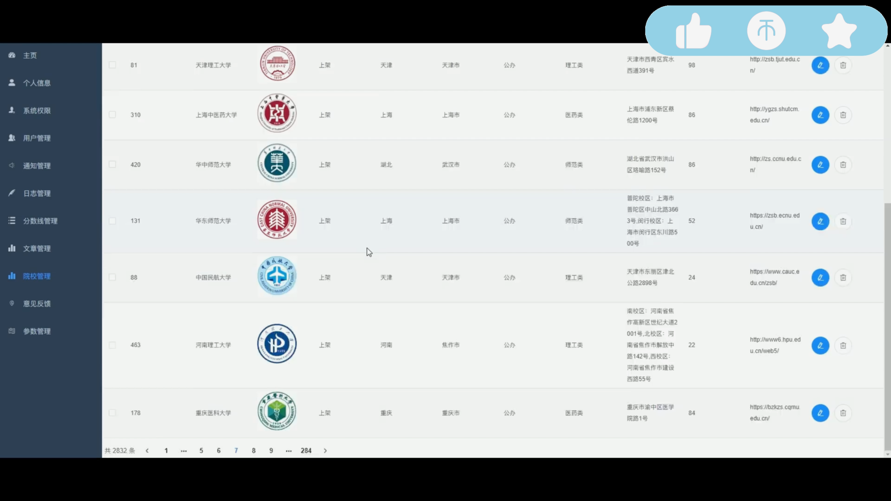
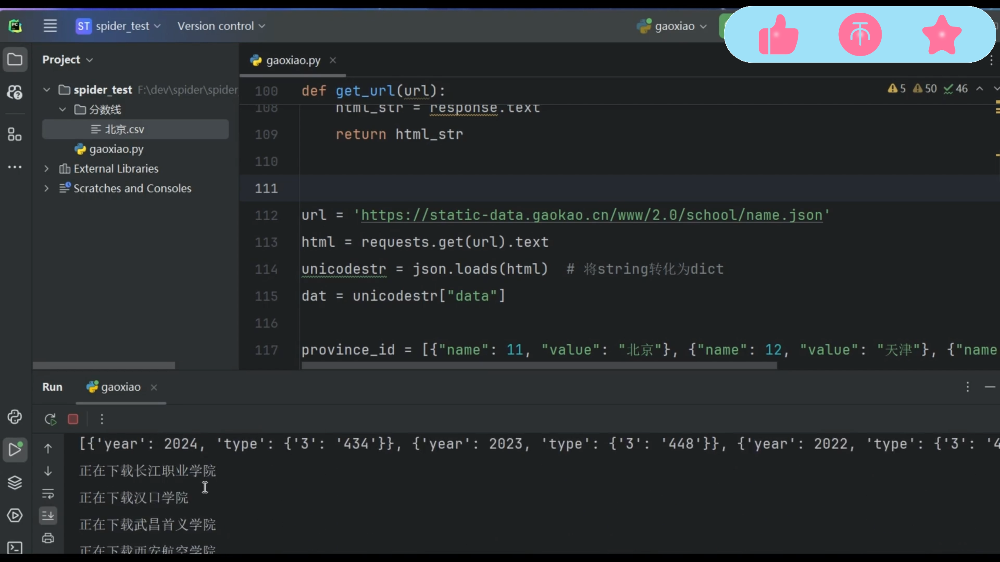
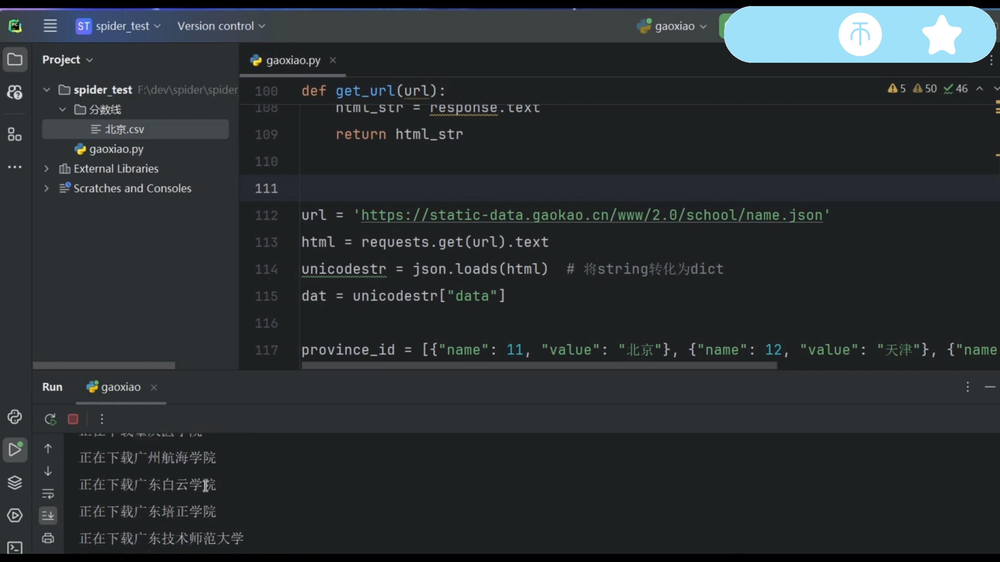

